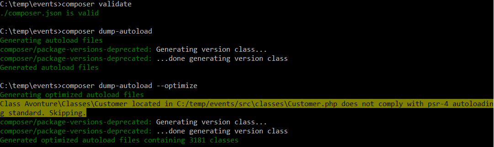

# Validate your file and your paths

By running `composer validate` you can validate the structure of your file but just that, just the structure. That process is also called `lint`.

Validate will verify if required nodes are present, if the node names are correct (`require-dev` and not `require_dev` f.i.).

Check the code here below:

```json
<!-- concat-md::include "./files/bad_composer.txt" -->
```

`composer validate` will tells that the file is correct (and it is, but only in terms of syntax)

**But there is well a problem!**

Pay attention to the value `/src/classes/`. The word `classes` is not capitalized like the others. On the disk, the folder is called `Classes` so there is here a case problem, lower case in the json and with the first capitalized letter on the disk.

The solution: we can highlight this problem by running `composer dump-autoload --optimize `.


